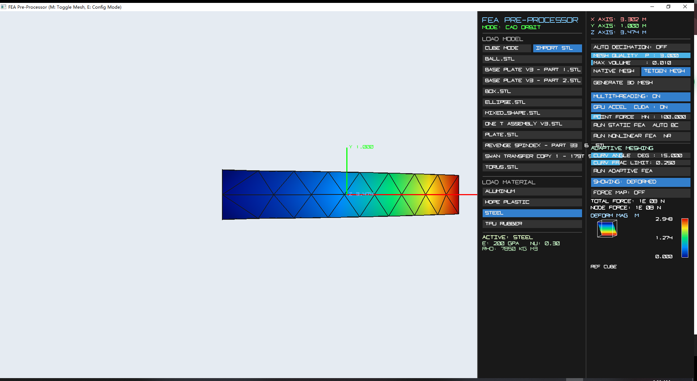

# PolyFEA — Volumetric Finite Element Solver


A high-performance 3D finite element analysis engine built from scratch in C++.
Solves structural deformation problems on arbitrary geometry using adaptive
tetrahedral meshes, a real-time OpenGL visualiser, and a fully custom
CUDA-accelerated solver — no commercial FEA libraries used.

**Author:** Jimmy Han — [@Jimmy-at-3am](https://github.com/Jimmy-at-3am)

---

## Table of Contents
- [What it does](#what-it-does)
- [Development history](#development-history)
- [Architecture](#architecture)
- [Mathematical foundation](#mathematical-foundation)
- [Solver pipeline](#solver-pipeline)
- [FDM layer slicing & G-code toolpath meshing](#fdm-layer-slicing--g-code-toolpath-meshing)
- [Headless scenario runner & regression testing](#headless-scenario-runner--regression-testing)
- [Visualiser](#visualiser)
- [Building from source](#building-from-source)
- [Examples](#examples)
- [Roadmap](#roadmap)
- [Technical acknowledgements](#technical-acknowledgements)

---

## What it does

PolyFEA takes an arbitrary STL, 3MF, or STEP model, tetrahedralizes it into a
volumetric finite element model, applies structural loads and boundary
conditions, and solves for nodal displacements and reaction forces. Results are
visualised in real time via a hardware-accelerated OpenGL renderer with scalar
heatmaps.

**Current capabilities:**
- Multi-format geometry import via a single dispatch interface:
  - **STL** with feature-preserving decimation via `meshoptimizer`
  - **3MF** compressed mesh containers (unzipped via `miniz`)
  - **STEP** with analytic B-rep retention via OpenCASCADE (exact NURBS kept live)
- 3D Delaunay tetrahedralization via `TetGen`
- Linear tetrahedral elements (Tet4) and quadratic tetrahedral elements (Tet10)
- Automatic adaptive promotion from Tet4 → Tet10 on curved geometry
- Linear static analysis and full Newton-Raphson nonlinear static analysis
- Point force, surface compression, cantilever bending, and tension load types
- Load symmetry enforcement across XZ reflection planes and polar radii
- Per-element mesh quality metrics (Knupp shape, dihedral angles, scaled
  Jacobian, radius ratio, equiangular skew) with histograms and worst-N reports
- Geometric fidelity validation (Hausdorff distance + normal deviation), with
  exact NURBS nearest-point comparison when a STEP B-rep is present
- Three solver backends: CUDA PCG, CPU Conjugate Gradient, CPU direct LDLT
- Automatic fallback cascade between all three solvers
- Real-time OpenGL 3.3+ visualiser with displacement and force heatmaps
- OpenMP multithreaded stiffness matrix assembly
- **FDM layer slicing**: slab-based cross-sectioning of any surface/B-rep model
  along a build axis, with conforming Tet4 slab meshing (`LayerSlicer` +
  `SlabMesher` + `StepSlicer`)
- **G-code toolpath ingestion**: parses Bambu Studio `.gcode.3mf` containers
  into per-layer bead geometry (`GcodeToolpathLoader` + `ToolpathModel`),
  reconstructs per-layer print cross-sections via polygon boolean union
  (`ToolpathSections`), and meshes the result with weak-tie layer interfaces
  for delamination studies
- Cross-section ("section view") slicing plane with an interactive height
  slider, rendered as a live schema overlay
- Async compute: long-running slice/mesh/solve jobs run on a background
  thread with a progress bar and user cancellation, instead of blocking the
  render loop
- Headless scenario runner + regression harness (`--run`, `--regress all`)
  driving the exact same geometry → mesh → solve pipeline as the UI, for
  repeatable, assert-checked test scenarios

---

## Development history

This project was built incrementally, each stage solving a real engineering
problem encountered in the previous one:

| Stage | What was built | Problem it solved |
|-------|---------------|-------------------|
| 1 | STL mesh importer + vertex extraction | Needed geometry input from real CAD files |
| 2 | Surface mesh decimation (`meshoptimizer`) | Raw STL files had pathologically dense polar caps on spherical geometry |
| 3 | Regional surface force analysis | First attempt at distributed loading |
| 4 | Switched to point force analysis | Regional forces produced uneven load distribution and unsolvable matrix conditions |
| 5 | Nonlinear Newton-Raphson solver | Linear solver could not handle large-deformation problems |
| 6 | OpenMP multithreaded assembly | Single-threaded stiffness assembly was the primary bottleneck at scale |
| 7 | Selective material properties (`IMaterial`) | Needed to model different materials without rewriting the assembly loop |
| 8 | CUDA PCG solver | CPU solvers were too slow for large meshes; PCIe bottleneck eliminated by keeping iteration in VRAM |
| 9 | Adaptive meshing | Tet4 elements produced inaccurate strain gradients on curved surfaces |
| 10 | Mesh quality + fidelity reports | Needed to detect sliver elements and quantify how well the mesh reproduces the input geometry |
| 11 | Multi-format loaders (3MF, STEP) | STL discards units and exact geometry; STEP retains analytic NURBS for far higher fidelity |
| 12 | STEP B-rep retention | Discrete-triangulation Hausdorff error masked true surface accuracy; exact NURBS nearest-point fixes it |
| 13 | Headless `ScenarioRunner` + regression harness | Manual UI clicking couldn't catch regressions as the pipeline grew; needed a repeatable, assert-checked test suite |
| 14 | FDM layer slicing + slab meshing (`LayerSlicer`, `SlabMesher`, `StepSlicer`) | Needed to analyse 3D-printed parts as stacks of physical layers, not a single monolithic volume |
| 15 | G-code toolpath ingestion (`GcodeToolpathLoader`, `ToolpathModel`, `ToolpathSections`) | Slab geometry alone can't capture print-time weak points; the actual bead layout (walls, infill, support) determines real anisotropic strength |
| 16 | Async compute + progress/cancellation | Slicing, toolpath meshing, and solving on dense G-code models could take tens of seconds, freezing the render loop with no way to abort |
| 17 | Toolpath preview + section view (current) | Needed to visually verify sliced layers and toolpath meshing results before committing to a full solve |

---

## Architecture

```
PolyFEA/
├── include/
│   ├── IElement.h               # Abstract element interface (Tet4, Tet10 implement this)
│   ├── IMaterial.h              # Constitutive model interface (LinearElastic)
│   ├── IGeometryLoader.h        # Common loader interface → LoadedGeometry
│   ├── GeometryLoaderDispatch.h # Extension → loader factory (STL / 3MF / STEP)
│   ├── STLLoader.h / ThreeMFLoader.h / StepLoader.h
│   ├── BRepHandle.h             # pImpl wrapper isolating OpenCASCADE (analytic B-rep)
│   ├── MeshQuality.h            # Per-element quality + Hausdorff/normal-deviation fidelity
│   ├── LayerSlicer.h            # Build-axis slab cross-sectioning (mesh + B-rep sources)
│   ├── SlabMesher.h             # Slab / toolpath-lane → conforming Tet4 volumetric mesh
│   ├── GcodeToolpathLoader.h    # Bambu `.gcode.3mf` parser → ToolpathModel
│   ├── ToolpathModel.h          # Parsed bead-segment data contract (layers, features, bbox)
│   ├── ToolpathSections.h       # Bead segments → per-layer cookie polygons (Clipper2 + CDT)
│   ├── ScenarioRunner.h         # Headless JSON scenario + regression harness
│   ├── FEASolver.h              # Solver orchestration, load types, solver selection
│   ├── CudaSolver.h             # GPU PCG entry point
│   └── FEAModel.h               # Mesh data, deformed positions, retained B-rep, GPU flags
├── src/
│   ├── FEAModel.cpp             # Mesh construction, TetGen interface, meshoptimizer pipeline
│   ├── FEASolver.cpp            # Stiffness assembly (OpenMP), boundary conditions, Newton-Raphson
│   ├── MeshQuality.cpp          # Quality metrics, BVH fidelity, OCC exact-nearest-point path
│   ├── StepLoader.cpp / BRepHandle.cpp  # OpenCASCADE-aware translation units
│   ├── LayerSlicer.cpp / StepSlicer.cpp # Slab cross-sections from triangulated / B-rep surfaces
│   ├── SlabMesher.cpp           # Ear-clip + prism-split slab meshing, toolpath-lane meshing
│   ├── GcodeToolpathLoader.cpp / ToolpathSections.cpp  # G-code ingest + per-layer bead cookies
│   ├── ScenarioRunner.cpp       # `--run` / `--regress all` headless pipeline driver
│   ├── CudaSolver.cu            # Jacobi-preconditioned CG in CUDA (cuSPARSE SpMV + kernels)
│   └── main.cpp                 # OpenGL render loop, GLFW/GLAD, SimpleUI overlay, async jobs
├── scenarios/            # JSON scenario definitions consumed by ScenarioRunner
├── regression/           # Expected-result sentinel files checked by `--regress all`
├── tools/                # Fixture generators (gen_step_fixtures, gen_unit_cube_stl)
├── assets/               # Example models, G-code fixtures, materials, and screenshots
├── lib/                  # Third-party compiled dependencies
├── CMakeLists.txt
└── build.bat
```

**Key design principles:** Element mathematics are fully separated from global
assembly via the `IElement` interface — adding a new element type (Hex8, shells)
requires no modification to the multithreaded assembly loop in `FEASolver.cpp`.
Likewise, every input format implements `IGeometryLoader`, so adding a format
touches only the dispatch factory, and OpenCASCADE is confined behind the
`BRepHandle` pImpl so only two translation units pay its compile cost (and the
whole project still builds with `USE_OCCT=OFF`).

---

## Mathematical foundation

### Governing equation

For a linear elastic solid under static equilibrium:

```
∇·σ + b = 0    (equilibrium in domain Ω)
u = ū           (displacement BC on Γ_u)
σ·n = t̄         (traction BC on Γ_t)
```

### Weak form

```
∫ ε(v) : C : ε(u) dΩ = ∫ v·b dΩ + ∫ v·t̄ dΓ
```

### Discretised system

```
[K] {u} = {F}
```

Where `[K]` is the global sparse stiffness matrix assembled from element
contributions using isoparametric shape functions over tetrahedral domains.

### Constitutive model

Isotropic linear elasticity. The 6×6 constitutive matrix `D` is built from
Young's Modulus `E` and Poisson's Ratio `ν` via the `IMaterial` / `LinearElastic`
interface. Material properties are dynamically loaded from external `.mat` 
configuration files (e.g., `steel.mat`), allowing users to simulate different 
materials without recompiling or modifying the assembly pipeline.

### Boundary conditions

Constrained DOFs are enforced via the **Penalty Method**:

```
K_ii += 10^7 × max(diag(K))
```

This avoids matrix restructuring while maintaining numerical conditioning.

### Nonlinear solver

For large-deformation problems, `solveNonlinearStatic` implements incremental
Newton-Raphson load stepping:

```
K_T(u) Δu = λ·F_ext − F_int(u)
```

The tangent stiffness `K_T` and internal force array are recomputed each
iteration until the L₂ residual norm satisfies convergence tolerance.

---

## Solver pipeline

### Mesh preparation

1. Dispatch on file extension to the matching loader (STL / 3MF / STEP) →
   extract surface vertices and triangles into a common `LoadedGeometry`. STEP
   additionally tessellates its B-rep via OpenCASCADE and retains the analytic
   shape on the model.
2. Normalise: translate centroid to origin, uniformly scale to a 3-unit
   bounding-box diagonal. For STL, optionally run `meshopt_simplify` for
   feature-preserving decimation — locks sharp boundary edges, removes
   pathologically dense regions (spherical caps).
3. Snapshot the input surface (`RefSurface`) for the post-mesh fidelity check.
4. Pass cleaned surface to `TetGen` for 3D Delaunay tetrahedralization
5. Adaptive check: compute vertex-normal deviations. If curvature exceeds
   threshold → promote mesh topology from Tet4 → Tet10, generating mid-edge
   nodes automatically.
6. Emit the quality report (per-element shape metrics) and the fidelity report
   (Hausdorff + normal deviation vs. the reference surface; exact NURBS
   nearest-point when a STEP B-rep is present)

### Point force deformation (step by step)

1. Scan `model.originalVolumetricPositions` — identify all nodes on the Z_min
   face within geometric tolerance (fixed boundary)
2. Compute (X, Y) centroid of Z_max boundary — find the single nearest node
3. Assemble global force vector `F` with `forceMagnitude` applied in −Z at
   that node only (eliminates surface-triangulation noise from area averaging)
4. Assemble global tangent stiffness `K` via OpenMP parallel loop over elements
5. Lock Z_min DOFs via Penalty Method
6. Solve `K·U = F` via selected backend (CUDA → CPU CG → CPU LDLT cascade)
7. Scale `U` by visual multiplier → write to `model.deformedPositions` →
   set `model.needsUpdate` → GPU re-uploads buffer on next frame

### Solver backend selection

| Backend | Method | Best for |
|---------|--------|----------|
| CUDA PCG | Preconditioned Conjugate Gradient (custom CUDA kernels + cuSPARSE SpMV) | Large meshes — entire iteration stays in VRAM |
| CPU CG | `Eigen::ConjugateGradient` + Jacobi preconditioner + OpenMP | Mid-size meshes, no GPU available |
| CPU Direct | `Eigen::SimplicialLDLT` (sparse Cholesky) | Small meshes or ill-conditioned matrices |

The solver automatically falls back down this chain. If CUDA runs out of VRAM,
it catches the failure and continues on CPU CG. If CG fails to converge, it
falls back to the exact direct solver.

**Memory optimisation:** The triplet vector used to build the sparse matrix
is explicitly deallocated immediately after `setFromTriplets` — on large
meshes this recovers up to ~15 GB of system RAM before the solve begins.

---

## FDM layer slicing & G-code toolpath meshing

Two independent ways to turn a 3D-printed part into a physically meaningful
volumetric mesh, both producing conforming Tet4 slabs along a build axis:

### Slab meshing from surface/B-rep geometry (`LayerSlicer` + `SlabMesher`)

1. `LayerSlicer::computeSlices()` samples the loaded surface mesh (or, when a
   STEP B-rep is present, the analytic shape via `StepSlicer::sliceBRepPlane`)
   at the centre of every slab along the chosen build axis, producing one
   `Section` per slab with outer loops CCW and holes CW.
2. `SliceGrouping` derives the physical layer count, the slab-to-layer
   grouping factor, and slab thickness in both model units and millimetres.
3. `SlabMesher::meshSlabs()` ear-clip triangulates each 2D cross-section,
   extrudes it into a prism along the build axis, and splits every prism into
   3 Tet4 elements using the Dompierre rule (guaranteed positive Jacobians).
   Adjacent slabs with identical topology share ring nodes, so the resulting
   mesh is conforming across layer boundaries.

### G-code toolpath meshing (`GcodeToolpathLoader` + `ToolpathSections` + `SlabMesher`)

1. `GcodeToolpathLoader` reads a Bambu Studio `.gcode.3mf` (a ZIP container),
   extracts `Metadata/plate_1.gcode`, and tessellates G2/G3 arcs at ~0.3 mm
   sagitta into a `Toolpath::ToolpathModel` — bead segments with nozzle
   endpoints, line width, and layer height, tagged by feature (outer wall,
   inner wall, infill, support, …) and optionally filtered to exclude print
   aids.
2. `ToolpathSections` converts each layer's bead segments into "cookie"
   polygons: every segment is rectangle-ized from its stadium cross-section,
   unioned via **Clipper2** (non-zero fill rule), then morphologically closed
   (inflate → deflate) to weld small gaps and seal corners, and simplified to
   drop dust loops — preserving the sparse-infill pattern rather than
   collapsing it into a solid slab.
3. `SlabMesher::meshToolpathSlabs()` triangulates the resulting multi-hole
   sections with **CDT** (constrained Delaunay — needed once infill has
   dozens of holes per layer) and meshes each toolpath lane, inserting
   barycentric weld ties between adjacent slabs (`LayerStack::interfaces`) so
   layer-adhesion strength can later be modelled as weaker than in-plane bead
   strength — the basis for delamination studies.

Both pipelines report progress through `progressOut`/`cancelRequested`
callbacks (see [Async compute](#async-compute) below) and are driven by the
same UI buttons that the scenario runner calls headlessly.

---

## Headless scenario runner & regression testing

`ScenarioRunner` is a thin CLI wrapper over the *exact* functions the
interactive UI buttons call — geometry load → slice/mesh → solve → visualise
— so there is never a second, divergent pipeline for tests versus the app.

```bat
FEAPreProcessor --run scenarios/demo_box_linear.json --out report.json --shots shots/
FEAPreProcessor --regress all
```

- `--run <scenario.json>` executes one JSON scenario (geometry fixture,
  slicing/meshing strategy, material, load type and magnitude, and assertion
  thresholds on stress/displacement/fracture), writing a machine-readable
  `report.json` (mesh stats, solver telemetry, fracture totals, probe values)
  plus PNG screenshots, and exits 0 (asserts passed) / 1 (assert failed) / 2
  (could not run).
- `--regress all` runs every file in `scenarios/*.json` against the
  corresponding sentinel in `regression/*.txt`, prints a one-line pass/fail
  table per scenario, and returns the aggregate exit code — this is the
  project's self-check oracle and is expected to pass cleanly from the repo
  root.
- `scenarios/` currently covers: linear/fracture demo boxes, three-point
  bending shafts (lying/standing), G-code ingestion (box/pod, with and
  without print aids), G-code section extraction, G-code slab meshing
  (standard and weak-tie toolpath variants), slice-contour extraction
  (box/concentric/holed), and unit-conversion checks.

---

## Visualiser

Built on OpenGL 3.3+ with GLFW and GLAD.

- **Frame loop:** Uncapped render loop tied to monitor refresh rate
- **Buffer strategy:** Vertex buffers are strictly static — `glBufferSubData`
  is called only when `model.needsUpdate` is flagged by the solver, never
  every frame
- **Rendered entities:**
  - Volumetric mesh with transparency toggle
  - Scalar heatmap via `updateScalarFieldData` — paints nodal displacement
    magnitudes or force magnitudes using a dynamic gradient shader
  - Force arrow vectors (`ForceArrow`) drawn at load application sites
  - Toolpath preview — sliced layer contours and per-layer toolpath sections
    rendered as line segments, steppable layer-by-layer
  - Section view — an interactive `SECTION_Z` height slider drives
    `model.sectionZModel`; when `model.sectionEnabled` is set, the cross-section
    at that height is drawn via `model.drawSectionPlane()` as a live schema
    overlay
  - Schema axes and boundary grid
  - `SimpleUI` C++ immediate-mode overlay rendered without CAD viewport overlap

### Async compute

Slicing, toolpath meshing, and solving on dense models can take tens of
seconds — too long to block the render loop. A `ComputeJob` (worker thread +
`std::atomic<bool> cancel` + `std::atomic<float> progress`) runs the same
functions the UI buttons call, checking progress/cancellation between layers
or solver iterations so it can unwind cleanly without partial results. A
sliding bottom-left panel shows a progress bar (or an animated stripe for
indeterminate stages) with a cancel button; multi-stage jobs — e.g. toolpath
sections → slab mesh → solve — report progress across weighted sub-ranges of
the bar.

---

## Building from source

### Prerequisites

- Visual Studio 2019 or 2022 with **C++ Desktop** and **C++ CMake tools** workloads
- CUDA Toolkit 11+ (optional — CPU fallback is automatic; pass `-DUSE_CUDA=OFF` to skip)
- OpenCASCADE 7.8+ (optional — required only for STEP import; install separately
  and pass `-DOCCT_ROOT=<path>`, or build without it via `-DUSE_OCCT=OFF`. STL
  and 3MF import work regardless.)
- OpenGL 3.3+ capable GPU

Everything else (Eigen, miniz, meshoptimizer, Clipper2, CDT, nlohmann/json) is
fetched automatically by CMake at configure time. Clipper2 and CDT are
optional (`-DUSE_CLIPPER2=OFF` / `-DUSE_CDT=OFF`) — toolpath section meshing
degrades gracefully without them.

### Windows

```bat
git clone --recurse-submodules https://github.com/Jimmy-at-3am/OpenGL-based-FEA-tet10-solver-with-cuda-multithreading-acceleration.git
cd OpenGL-based-FEA-tet10-solver-with-cuda-multithreading-acceleration
build.bat build
```

> **Note:** `--recurse-submodules` is required — it downloads `meshoptimizer` alongside the repo.
> If you already cloned without it, run `git submodule update --init` inside the repo folder.

For a CPU-only build (no CUDA required):

```bat
build.bat configure -DUSE_CUDA=OFF
build.bat build
```

---

## Examples

### Benchmark — cantilever beam under point load

Validation against the classical Euler–Bernoulli analytical solution for tip
deflection of a cantilever beam:

| Parameter | Value |
|-----------|-------|
| Geometry | 5.0 × 1.0 × 1.0 m rectangular beam |
| Material | Steel — E = 200 GPa, ν = 0.30 |
| Load | 100 MN point force at free end (−Z) |

```
δ = FL³ / 3EI      (Euler–Bernoulli beam theory)
Analytical result: δ = 0.25 m
```

Five meshes of the same geometry were tested by varying TetGen's mesh quality
constraint and maximum element volume parameter independently. This isolates
the effect of element shape quality versus mesh density on solver accuracy.

| Run | Mesh Quality | Max Volume | Nodes | Elements | FEA Output | Error |
|-----|-------------|------------|-------|----------|------------|-------|
| 1   | 1.4         | 0.1%       | 81    | 24       | 0.2421 m   | 3.171% |
| 2   | 3.0         | 0.001%     | 1808  | 994      | 0.2566 m   | 2.631% |
| 3   | **3.0**     | **0.01007%** | **294** | **122** | **0.2506 m** | **0.246%** ✅ |
| 4   | 2.088       | 0.01007%   | 318   | 139      | 0.2520 m   | 0.790% |
| 5   | 3.0         | 0.004629%  | 426   | 192      | 0.2537 m   | 1.483% |



**Key finding — mesh quality dominates over mesh density:**
Run 2 uses 1808 nodes (the densest mesh) yet produces 2.631% error. Run 3 uses
only 294 nodes but achieves 0.246% error — the best result. The difference is
the maximum volume constraint: Run 2's extremely tight volume cap (0.001%)
forces TetGen to generate many small, poorly-shaped elements to satisfy the
constraint, degrading aspect ratios and hurting accuracy more than the extra
nodes help.

Comparing Runs 3 and 4 directly isolates the quality parameter effect: both
share identical Max Volume (0.01007%) and nearly identical node counts (294 vs
318), yet quality 3.0 achieves 0.246% versus quality 2.088 at 0.790% — a 3×
accuracy improvement from shape quality alone.

This is consistent with established tetrahedral FEA theory: element aspect
ratio is the primary driver of numerical accuracy, not node count.

---

## Roadmap

- [x] STL mesh import and surface decimation
- [x] 3MF and STEP mesh import (multi-format dispatch)
- [x] STEP analytic B-rep retention (OpenCASCADE)
- [x] 3D Delaunay tetrahedralization (TetGen)
- [x] Linear Tet4 elements
- [x] Point force, surface compression, and tension static analysis
- [x] Newton-Raphson nonlinear solver
- [x] OpenMP multithreaded assembly
- [x] Selective material properties (IMaterial interface)
- [x] CUDA PCG accelerated solver
- [x] Adaptive Tet4 → Tet10 mesh promotion
- [x] Per-element mesh quality metrics + Hausdorff/normal-deviation fidelity
- [x] Headless scenario runner + regression harness (`--run`, `--regress all`)
- [x] FDM layer slicing + conforming slab meshing (`LayerSlicer`, `SlabMesher`, `StepSlicer`)
- [x] G-code toolpath ingestion + per-layer bead cookie meshing with weak-tie interfaces
- [x] Async background compute with progress reporting and cancellation
- [x] Toolpath preview and interactive section-view slicing plane
- [ ] Von Mises stress and principal stress output
- [ ] Pressure boundary conditions
- [ ] Thermal analysis coupling (heat conduction FEA)
- [ ] Additional element types (Hex8, shell elements)
- [ ] Export to VTK / ParaView format

---

## Technical acknowledgements

- **[TetGen](http://www.tetgen.org)** — Hang Si, WIAS Berlin. 3D Delaunay tetrahedralization.
- **[meshoptimizer](https://github.com/zeux/meshoptimizer)** — Arseny Kapoulkine. Feature-preserving mesh decimation.
- **[OpenCASCADE](https://www.opencascade.com)** — STEP I/O, B-rep tessellation, exact NURBS nearest-point queries (optional, `USE_OCCT`).
- **[miniz](https://github.com/richgel999/miniz)** — Rich Geldreich. ZIP decompression for 3MF and `.gcode.3mf` containers.
- **[Clipper2](https://github.com/AngusJohnson/Clipper2)** — Angus Johnson. Robust 2-D polygon boolean union/offset for toolpath cookie sections (optional, `USE_CLIPPER2`).
- **[CDT](https://github.com/artem-ogre/CDT)** — Artem Ogre. Constrained Delaunay triangulation for multi-hole toolpath sections (optional, `USE_CDT`).
- **[nlohmann/json](https://github.com/nlohmann/json)** — Niels Lohmann. JSON parsing for scenario files and reports.
- **[Eigen](https://eigen.tuxfamily.org)** — Sparse matrix storage, SimplicialLDLT, ConjugateGradient solvers.
- **[GLFW](https://www.glfw.org)** and **[GLAD](https://glad.dav1d.de)** — OpenGL context and extension loading.
- **[CUDA Toolkit](https://developer.nvidia.com/cuda-toolkit)** / **cuSPARSE** — NVIDIA. GPU sparse matrix-vector products.

---

*Built independently as part of ongoing engineering research.
Started January 2026 — actively developed.*
